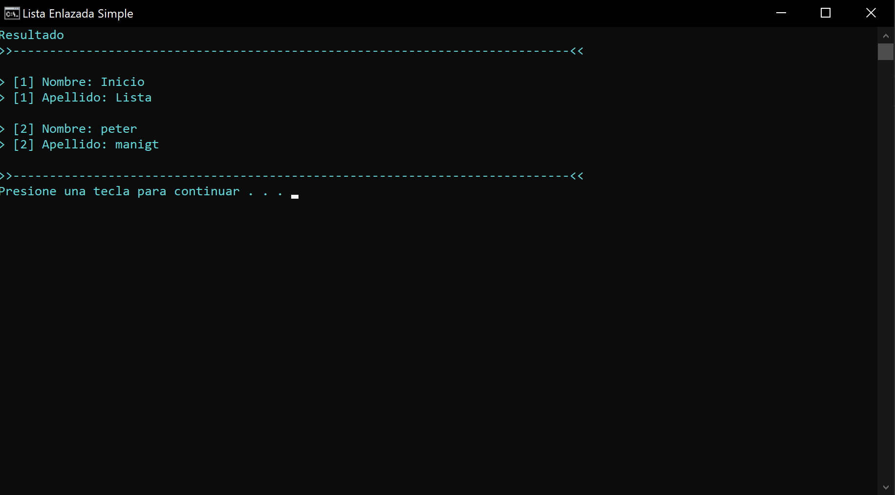
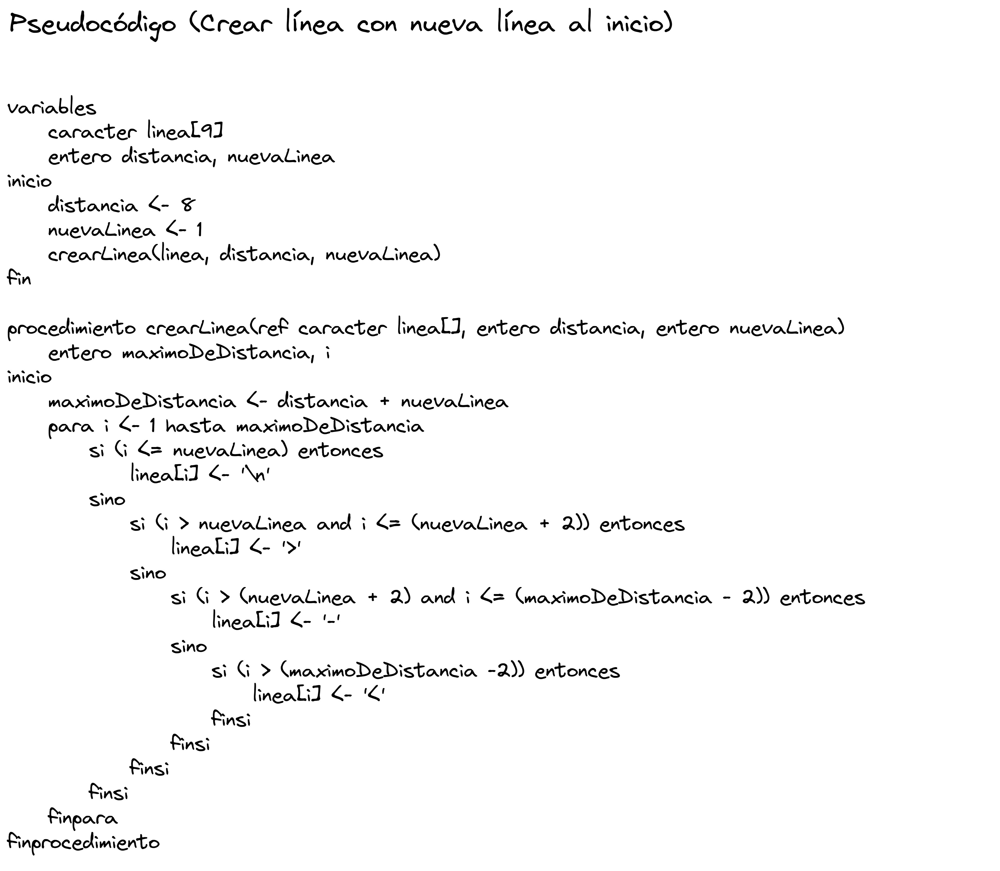
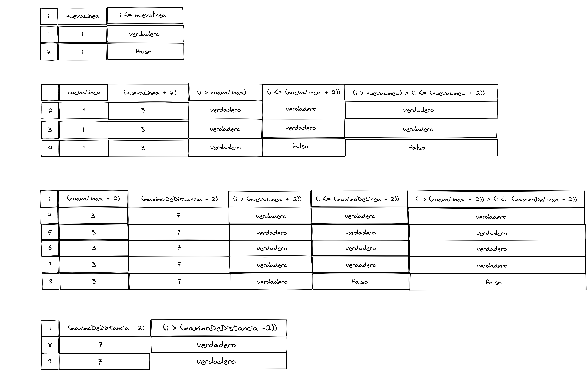
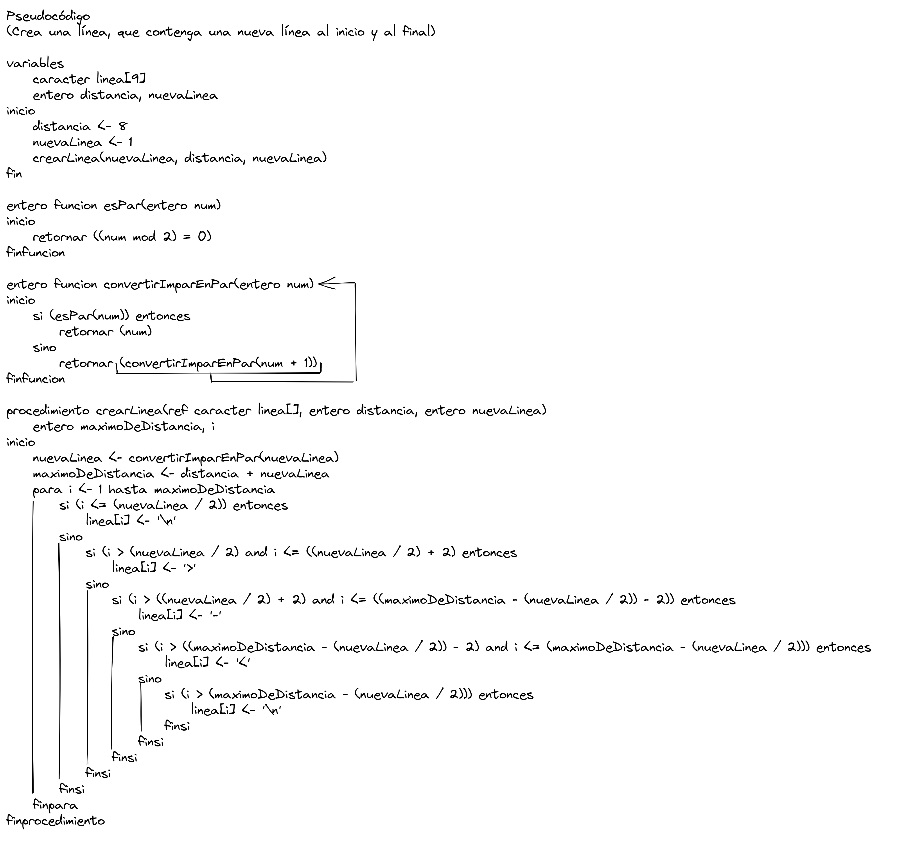
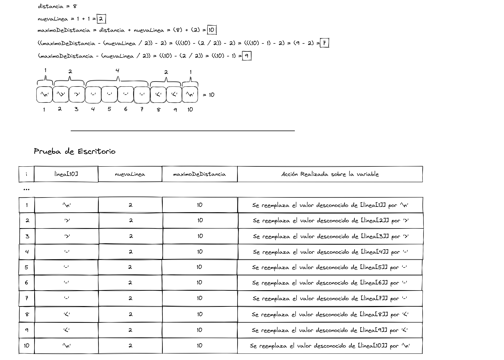

# Lista Enlazada Simple [JAVA]

Este proyecto fue desarrollado con el único fin de experimentar.

## Ejecutar localmente

Clonar el proyecto

```bash
  git clone https://github.com/DevUsuiSama/ListaEnlazadaSimple-JAVA.git
```

Ir al directorio del proyecto

```bash
  cd .\ListaEnlazadaSimple-JAVA\
```

Instalar JDK17 - comprobar versión

```bash
  java --version
```

Iniciar programa

```bash
  .\ListaEnlazadaSimple.cmd
```
## Captura de Pantalla



## Análisis [Paquete Línea]

### Línea NLI




### Línea NLD




## Construido con 🛠️

- Lenguaje **JAVA** 

## Autor ✒️

- **Usui, José Fernando** - _Diseño y Desarrollo del Sistema_

## Contacto 📱

- Gmail: _joesesilvae@gmail.com_